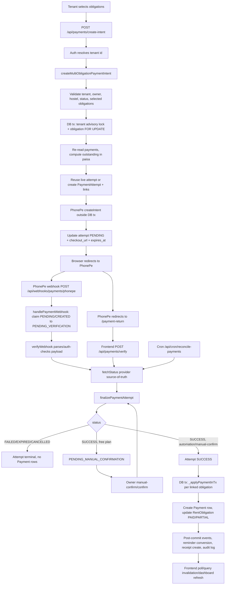

# HMS Payments Architecture Audit

Date: 2026-05-12  
Scope: backend payment lifecycle, PhonePe provider, ledger/receipts/invoices, webhook/reconciliation, multi-hostel isolation, frontend payment UX.

## 1. Current Architecture Map

### Core Data Model

- `PaymentAttempt`: gateway-facing intent. Stores provider, merchant transaction id, gateway id, amount, status, checkout URL, raw provider data, `payment_type`, optional `obligation_id`, optional `invoice_id`, optional `tenant_id`, optional `hostel_id`.
- `Payment`: canonical rent money movement. One row per obligation allocation, linked to `rent_obligations`, optional `payment_attempt_id`, optional `payment_group_id`, unique optional `idempotency_key`, immutable `hostel_id`.
- `RentObligation`: canonical receivable. `amount` is the balance basis. `total_amount` and `late_fee` exist but canonical services deliberately avoid summing `total_amount`.
- `PaymentAttemptObligation`: junction table for multi-obligation gateway attempts.
- `Receipt`: one receipt per `Payment`, unique by `payment_id`, unique receipt number per hostel.
- `TenantAdvanceLedger`: advance/deposit ledger. Balance is recomputed from ledger entries, not trusted from `balance_after`.
- `OwnerInvoice`: owner subscription billing invoice, also paid via `PaymentAttempt`.

### Services and Entry Points

- Core service: `backend-next/lib/services/payment-service.ts`
- Provider: `backend-next/lib/services/payments/providers/phonepe.ts`
- Provider factory/base: `backend-next/lib/services/payments/provider-factory.ts`, `provider-base.ts`
- Financial calculations: `backend-next/lib/services/financial-service.ts`
- Receipts/invoices: `backend-next/lib/services/receipt-service.ts`, `invoice-service.ts`
- Advance ledger: `backend-next/lib/services/tenant-advance-service.ts`
- Events/cache/activity: `backend-next/lib/events/index.ts`, `event-bus.ts`, `dashboard-cache.ts`
- Payment APIs:
  - `/api/payments/create-intent`
  - `/api/payments/verify`
  - `/api/webhooks/payments/phonepe`
  - `/api/cron/reconcile-payments`
  - `/api/payments/record-offline`
  - `/api/payments/manual-confirm`
  - `/api/payments/confirm`
  - `/api/payments/reconcile`
  - `/api/payments/[id]/receipt`
  - `/api/payments/preview`
  - `/api/payments/pending-verification`
  - `/api/payments/pay-dues`
  - `/api/payments/submit-reference`
- Frontend:
  - `frontend/src/components/tenant/payment/PaymentModal.jsx`
  - `frontend/src/pages/tenant/TenantPaymentReturn.jsx`
  - `frontend/src/hooks/usePayments.js`
  - `frontend/src/api/services.js`
  - owner payments components under `frontend/src/components/owner/payments`

## 2. Full Payment Lifecycle Diagram

## 3. Existing Strengths

- Core rent finalization uses row-level locks on `rent_obligations` and paisa-safe arithmetic in `_applyPaymentInTx`.
- Multi-obligation intent creation uses a tenant-scoped advisory lock plus obligation `FOR UPDATE`, and gateway I/O happens outside the transaction.
- Webhooks do not trust provider payload alone; they call `fetchStatus` before finalizing.
- `merchant_txn_id` and `gateway_txn_id` are unique in the Prisma schema.
- Payment rows created from gateway attempts use deterministic idempotency keys: `pay:{attemptId}:{obligationId}`.
- Advance gateway credit has a ledger reference idempotency index via `idx_tal_ref_idempotency`.
- Receipt creation is idempotent by `payment_id` and retries receipt number conflicts.
- Reconciliation exists and handles stale `CREATED`, expired `PENDING`, stale `PENDING_VERIFICATION`, and stale `PROCESSING`.
- Owner manual confirmation path exists for plan-gated automation.
- Dashboard and analytics mostly route through `FinancialService`, which defines operational versus historical dues.

## 4. Critical Risks

### BLOCKER: PaymentAttempt hostel isolation is optional at schema level

`PaymentAttempt.hostel_id` is nullable in Prisma and the hardening migration only adds the column, not `NOT NULL`. Rent and advance code usually writes it, but addon/subscription attempts do not. Core methods call `requireFinancialHostelId` for rent verification/reconciliation, which is good, but the table still allows unsafe rows and mixed semantics.

Required change: enforce non-null `hostel_id` for rent/advance attempts, or split owner-level billing/addon attempts from hostel-scoped tenant payments with explicit constraints.

### BLOCKER: Receipt download has no ownership/tenant authorization check

`/api/payments/[id]/receipt` authenticates, then calls `receiptService.generatePdfBuffer(paymentId)` without verifying the payment belongs to the requester. The receipt service validates internal hostel consistency but not caller ownership. Any authenticated user who learns a `paymentId` may fetch a receipt.

Required change: route must load payment + receipt scope and enforce tenant self-access or owner/admin hostel ownership before rendering.

### BLOCKER: Webhook authentication can be effectively optional

The route only checks Basic Auth if username/password/authHeader are all present. `PhonePeProvider.verifyWebhook` also only validates when credentials and auth header exist. If env credentials are missing, or if credentials exist but the header is omitted in the route, processing can continue until provider fetch status. Provider source-of-truth protects status fraud, but unauthenticated callers can force provider API calls, lock attempts, create noise, and potentially trigger finalization for known merchant ids.

Required change: production must fail closed when webhook credentials are configured or required, and must reject missing Authorization.

### HIGH: State is marked SUCCESS before rent Payment rows are created

In `finalizePaymentAttempt`, the rent path updates `PaymentAttempt` to `SUCCESS` before `_applyPaymentInTx` creates `Payment` rows. If the process crashes between those steps, reconciliation will not pick it up because it only recovers stale `PROCESSING` attempts and scans `PENDING`. The attempt becomes terminal `SUCCESS` with no ledger settlement.

Required change: for rent attempts, update attempt and create payments in one transaction, or use an intermediate committed state and reconcile terminal-success-without-payment.

### HIGH: Payment events do not include `hostel_id`, causing stale hostel dashboards

`eventSystem.trigger("payment_recorded", ...)` calls omit `hostel_id` in manual, tenant FIFO, and gateway finalization paths. The event system only invalidates hostel cache when `data.hostel_id` is present; otherwise it invalidates portfolio only. Frontend mutations often compensate for manual flows, but webhook/verify/server-side finalization can leave hostel dashboards stale.

Required change: every payment event must include immutable `payment.hostel_id`.

### HIGH: Direct owner confirmation of `PENDING_VERIFICATION` bypasses provider verification

`/api/payments/confirm` can confirm `PENDING_VERIFICATION` attempts. That status is used both for tenant-submitted UPI references and webhook-claimed attempts. If a real PhonePe webhook sets `PENDING_VERIFICATION` before provider verification fails or stalls, an owner can manually confirm without rechecking provider source of truth.

Required change: separate statuses for manual UPI reference review versus provider-webhook verification, or make confirmation of provider attempts re-fetch provider status.

## 5. Financial Consistency Findings

### Canonical rules found

- `FinancialService` is the intended source of truth for operational dues, historical outstanding, tenant dues, cashflow, defaulters, dashboard, and analytics.
- Canonical remaining amount is `rent_obligations.amount - SUM(payments.amount_paid)`.
- Operational views filter `t.status = ACTIVE`; historical views do not.
- Late fees are modeled as separate `LATE_FEE` obligations, not summed through `total_amount`.

### Divergent calculation branches

- `payment-service.getDuesReport` calculates outstanding itself and uses `obligation.amount`, not `FinancialService.getTenantDues`.
- `payment-service.getAllPayments` computes row status and balances locally, while only stats use `financialService.getOperationalDues`.
- `payment-service.previewPaymentAmount` computes outstanding locally and does not enforce hostel ownership for owner requests.
- `payment-service.getTenantPaymentHistory` formats obligations from all tenant obligations, then overlays `FinancialService.getTenantDues` for totals.
- Frontend `paymentService.getTenantHistory` reconstructs tenant history by combining `/payments/dues` and `/payments`, with field-name mismatches (`p.obligation_id` vs returned `obligationId`, `amount_paid` vs returned `paidAmount`/records). This can make owner-side tenant history inconsistent with backend history.
- `TenantAdvanceService._computeBalance` is tenant-only, not tenant+hostel. If a tenant is transferred and advance ledger rows span hostels, balance may aggregate across historical hostel contexts.

### Invariants status

- Payment application prevents overpayment under lock for obligation-specific and FIFO flows.
- Gateway multi-obligation attempts compute amount under lock but final settlement later trusts the junction amounts. It still revalidates balance in `_applyPaymentInTx`.
- Receipt totals match a single `Payment` row. Multi-obligation gateway payments create only one receipt anchored to the first payment, so receipt totals do not represent the full checkout amount.
- Owner dashboard and analytics mostly align through `FinancialService`, but event invalidation gaps can make cached/snapshot views temporarily wrong.

## 6. Multi-Hostel Isolation Findings

### Strong areas

- `RentObligation`, `Payment`, `Receipt`, `ReminderLog`, `TenantAdvanceLedger` include `hostel_id`.
- `_applyPaymentInTx` locks obligation by `id + hostel_id` and asserts tenant/allocation/payment hostel consistency.
- Multi-obligation gateway intents require all selected obligations to share exactly one hostel.
- `getProviderForOwner` validates hostel belongs to owner.
- Dashboard, analytics, dues, payment list, reminders, and financial service endpoints generally require hostel scope.

### Weak areas

- `PaymentAttempt.hostel_id` remains nullable and has mixed owner-level/hostel-level use.
- `PaymentAttemptObligation` has no `hostel_id` and no DB-level constraint that linked obligations match attempt hostel.
- `/api/payments/pending-verification` is owner-scoped only and ignores selected hostel; frontend keys it by hostel but fetches all owner pending attempts.
- `/api/payments/reconcile` is owner-scoped, not hostel-scoped. This may be acceptable for owner operations, but it cannot target or report per-hostel recovery.
- `/api/payments/preview` allows owners to preview arbitrary obligation ids with no owner/hostel authorization check; tenant self-check exists.
- `TenantAdvanceService.getBalance`, `_computeBalance`, and tenant self-balance are tenant-wide rather than hostel-scoped.
- `TenantAnalyticsService.calculateTenantScore`, reminder conversion stats, and recalculation are tenant/owner scoped but not hostel scoped.
- Event/activity logs have no `hostel_id` column in `ActivityLog`, weakening audit partitioning.

## 7. Production-Readiness Gaps

### BLOCKER

- Webhook auth must be mandatory and fail-closed in production.
- Receipt route must enforce ownership.
- Rent finalization must be atomic with attempt success state or recover success-without-ledger.
- `PaymentAttempt` schema constraints must distinguish hostel-scoped tenant payments from owner-level addon/subscription attempts.

### HIGH

- Add replay resistance: persist provider webhook event id/hash, first-seen time, processed status, and response outcome. Current architecture stores only latest raw payload on the attempt.
- Add a durable webhook event table. Current design can lose event history when repeated webhooks overwrite `raw_webhook_payload`.
- Ensure every event and cache invalidation includes `hostel_id`.
- Add a production reconciliation dashboard/report for stuck attempts, success-without-payment, payment-without-receipt, receipt-without-pdf, and provider/DB mismatches.
- Add provider downtime handling: retries/backoff are ad hoc; failed provider fetch during webhook returns 500 and relies on PhonePe retry plus cron.
- Add stale pending alerting. Cron exists, but no persistent operational alert or owner/admin view.

### MEDIUM

- Align frontend copy and service comments: several still say Razorpay or UPI direct, while actual flow is PhonePe checkout.
- Normalize status taxonomy. `PENDING_VERIFICATION` is overloaded.
- Make addon attempts hostel-aware or explicitly owner-level with separate table/statuses.
- Add refund execution workflow; current refund is ledger status only, no payment provider refund.
- Add idempotency keys for manual confirm/reject routes.

## 8. Security Risks

- BLOCKER: receipt PDF access lacks caller authorization.
- BLOCKER: webhook endpoint may accept missing Authorization depending on env/header state.
- HIGH: owner confirmation can bypass provider status for `PENDING_VERIFICATION`.
- HIGH: `/api/payments/preview` does not check owner ownership for owner/admin requests.
- MEDIUM: `/api/tenants/[id]/advance/refund-status` only checks ledger entry owner, not tenant id/path consistency.
- MEDIUM: `submit-reference` globally checks `gateway_txn_id` uniqueness but does not enforce payment provider/manual path separation.
- MEDIUM: addon provider config uses `findFirst` active hostel UPI and owner-level PhonePe env, not strict hostel/merchant isolation.
- LOW: logs include transaction identifiers and raw provider payloads; ensure secrets are not logged before production.

## 9. Reconciliation Risks

- Reconciliation ignores terminal `SUCCESS` attempts without payment rows.
- Reconciliation is owner/attempt scoped, not hostel scoped.
- Provider cache in reconciliation is keyed only by `owner_id`, but provider resolution includes hostel-specific config. Multi-hostel owners could reconcile attempts from different hostels with the first hostel's provider instance.
- `autoExpireResult` marks expired `PENDING` before provider status fetch. If provider later succeeds after local expiry, redirect verification will return cached terminal `EXPIRED` and not fetch source-of-truth.
- No durable reconciliation run table, no per-attempt reconciliation history, and no operator-visible diff.

## 10. Concurrency and Race-Condition Risks

- Good: obligation payment application uses `FOR UPDATE`.
- Good: multi-obligation intent creation serializes tenant attempts.
- Good: webhook and verify finalization uses a `PROCESSING` lock via atomic `updateMany`.
- Risk: rent finalization status update precedes ledger transaction.
- Risk: addon finalization has an idempotency gate inside the addon branch, but the outer `PROCESSING` lock already changed status, so the inner gate allows `PROCESSING`; this is okay for single caller but fragile.
- Risk: receipt number generation uses count+retry. It handles unique conflicts, but sequence gaps and retry storms are possible under heavy payment bursts.
- Risk: manual reject directly updates attempt to `FAILED` without the same `PROCESSING` lock used by confirmation/finalization.

## 11. Observability Gaps

- Metrics are in-memory only and not production-grade on serverless/multi-instance deployments.
- No payment attempt lifecycle timeline table.
- No webhook event table.
- No reconciliation run/audit table.
- No alerting for stuck attempts, webhook failures, source-of-truth mismatches, amount mismatches, receipt failures, or cache invalidation misses.
- Receipt creation failures are often fire-and-forget logs; failed receipt generation does not create a retryable job.
- `incrementPayment("success")` is called in webhook before final settlement; it can overcount successful payments if finalization later fails.

## 12. Schema Weaknesses

- `PaymentAttempt.hostel_id` nullable.
- No DB check expressing valid `PaymentAttempt` shapes:
  - rent single obligation,
  - rent multi-obligation links,
  - advance tenant deposit,
  - owner invoice,
  - addon purchase.
- `PaymentAttemptObligation` lacks `hostel_id` and amount-positive check.
- `ActivityLog` lacks `hostel_id`.
- No `PaymentWebhookEvent` table.
- No `PaymentReconciliationRun` / `PaymentReconciliationItem` table.
- No persistent refund transaction table.
- No immutable payment status transition log.

## 13. API Weaknesses

- `/api/payments/[id]/receipt`: missing authorization.
- `/api/payments/preview`: missing owner/admin ownership/hostel authorization.
- `/api/payments/pending-verification`: owner-scoped while frontend treats it as hostel-scoped.
- `/api/payments/reconcile`: no hostel targeting, no dry-run, no detailed per-attempt output.
- `/api/payments/confirm`: overloads confirmation for manual UPI and provider-gated attempts.
- `/api/payments/create-intent`: uses server-side amount for rent, good; advance amount is client-provided by design but should have configured caps.
- `/api/payments/submit-reference`: legacy/direct UPI path coexists with PhonePe checkout and can confuse status semantics.

## 14. Frontend UX Weaknesses

- `PaymentModal` includes manual UPI QR/reference flow, but PhonePe checkout currently redirects immediately when `checkout_url` exists. The fallback UI may be legacy and can confuse users/operators.
- `TenantPaymentReturn` handles redirect-before-webhook well with polling and focus retry, but after terminal `EXPIRED`/`FAILED` it does not force source-of-truth recheck.
- Owner pending verification query is keyed by hostel but fetches all owner pending attempts.
- Owner tenant payment history reconstruction in `frontend/src/api/services.js` appears inconsistent with backend response shapes.
- Query invalidation after gateway success depends mostly on return-page polling; webhook-only success may not refresh open owner dashboards because events omit `hostel_id`.
- Receipt download errors surface late; receipt entitlement/plan gating is not clearly separated from missing receipt.

## 15. Exact Files Requiring Changes

### BLOCKER

- `backend-next/app/api/webhooks/payments/phonepe/route.ts`
- `backend-next/lib/services/payments/providers/phonepe.ts`
- `backend-next/app/api/payments/[id]/receipt/route.ts`
- `backend-next/lib/services/payment-service.ts`
- `backend-next/prisma/schema.prisma`
- new migration under `backend-next/prisma/migrations`

### HIGH

- `backend-next/lib/events/index.ts`
- `backend-next/lib/services/receipt-service.ts`
- `backend-next/app/api/payments/preview/route.ts`
- `backend-next/app/api/payments/pending-verification/route.ts`
- `backend-next/app/api/payments/confirm/route.ts`
- `backend-next/app/api/payments/reconcile/route.ts`
- `backend-next/lib/services/tenant-advance-service.ts`
- `backend-next/lib/services/tenant-analytics-service.ts`
- `frontend/src/hooks/usePayments.js`
- `frontend/src/api/services.js`
- `frontend/src/pages/tenant/TenantPaymentReturn.jsx`

### MEDIUM

- `backend-next/lib/metrics.ts`
- `backend-next/app/api/metrics/route.ts`
- `backend-next/lib/services/invoice-service.ts`
- `backend-next/app/api/addons/purchase/route.ts`
- `backend-next/app/api/addons/verify/route.ts`
- `frontend/src/components/tenant/payment/PaymentModal.jsx`
- `frontend/src/components/owner/payments/*`
- `backend-next/vercel.json`

## 16. Ordered Implementation Roadmap

1. BLOCKER: Make webhook auth fail-closed and document required PhonePe env vars.
2. BLOCKER: Add receipt route authorization.
3. BLOCKER: Fix rent finalization atomicity or add recovery for `SUCCESS` attempts without payments.
4. BLOCKER: Add schema constraints for `PaymentAttempt` shapes and hostel scope.
5. HIGH: Add durable `payment_webhook_events` and store every webhook with idempotent processing.
6. HIGH: Add `payment_status_events` / audit timeline for every attempt transition.
7. HIGH: Add hostel id to all payment events and invalidate hostel dashboard snapshots reliably.
8. HIGH: Split `PENDING_VERIFICATION` into provider verification versus owner/manual review statuses.
9. HIGH: Fix reconciliation provider cache key to include owner+hostel+provider and scan terminal inconsistencies.
10. HIGH: Make pending verification and reconciliation hostel-filterable.
11. MEDIUM: Align all financial read models with `FinancialService` or clearly document exceptions.
12. MEDIUM: Make advance balance/refunds hostel-aware and add refund execution records.
13. MEDIUM: Replace in-memory payment metrics with persistent operational metrics or external telemetry.
14. LOW: Clean legacy Razorpay/direct-UPI naming and frontend fallback copy.

## 17. Priority Classification

| Priority | Finding |
| --- | --- |
| BLOCKER | Webhook auth may be optional |
| BLOCKER | Receipt access lacks ownership check |
| BLOCKER | Attempt success can commit before ledger settlement |
| BLOCKER | `PaymentAttempt.hostel_id` nullable/mixed semantics |
| HIGH | Missing durable webhook event log |
| HIGH | Missing attempt status transition log |
| HIGH | Event invalidation lacks `hostel_id` |
| HIGH | Reconciliation misses terminal-success-without-payment |
| HIGH | Provider cache keyed only by owner during reconciliation |
| HIGH | `PENDING_VERIFICATION` status overloaded |
| MEDIUM | Advance ledger balance tenant-wide, not hostel-scoped |
| MEDIUM | Frontend owner payment history reconstruction drift |
| MEDIUM | In-memory metrics not production-grade |
| LOW | Legacy Razorpay/UPI-direct comments and copy |

## 18. Recommended Production Architecture

- Treat `PaymentAttempt` as the state machine and `Payment` as the accounting ledger.
- Every provider event should first become a durable `PaymentWebhookEvent`.
- Webhook processing should be idempotent by provider event id or body hash + merchant order id.
- Attempt finalization should be a single DB transaction for status transition plus ledger mutation.
- All tenant/rent payment attempts must have non-null `hostel_id`.
- Owner-level purchases should either have a separate table or explicit `scope_type = OWNER`.
- All status changes should append to `PaymentAttemptStatusEvent`.
- Reconciliation should compare provider state, attempt state, payment rows, obligation balances, and receipt rows.
- Observability should be persistent and operator-facing, not only logs.

## 19. Recommended Phased Rollout Strategy

1. Internal sandbox only: run PhonePe checkout with forced webhook/redirect order variations.
2. Staff hostel pilot: enable one hostel, low-value transactions, daily reconciliation.
3. Owner beta: limited owners, daily attempt/ledger diff report, manual review of all failed/pending cases.
4. Controlled production: enable automation only for owners with clean reconciliation for 7 days.
5. Full rollout: enable cron alerting, dashboards, support runbooks, and refund operations.

## 20. Recommended Testing Strategy

- Unit tests for PhonePe webhook auth: missing header, wrong header, Basic Auth, hash auth, malformed payload.
- Unit tests for amount mismatch, merchant id mismatch, provider pending versus webhook success.
- Transaction tests for crash points: success-before-payment, payment-before-receipt, processing lock recovery.
- Multi-hostel tests proving hostel A attempts cannot mutate hostel B obligations/payments/receipts/analytics.
- API authorization tests for receipt, preview, pending verification, reconcile, confirm/reject.
- Financial invariant tests comparing dashboard, analytics, dues report, tenant history, and ledger totals.
- Frontend tests for return polling, timeout recovery, manual retry, owner pending verification filtering.

## 21. Recommended Load-Testing Plan

- Concurrent create-intent calls for same tenant and overlapping/non-overlapping obligations.
- Concurrent webhook + redirect verify for same attempt.
- 100 duplicate webhooks for same successful attempt.
- Bulk reconciliation for many owners and hostels.
- Receipt PDF burst after monthly rent day.
- Dashboard refresh during webhook settlement bursts.
- Provider timeout simulation at create, webhook fetch, verify, and reconcile stages.

## 22. Recommended Failure Simulation Plan

- PhonePe create order timeout after attempt creation.
- PhonePe webhook arrives before redirect.
- Redirect verify arrives before webhook.
- Webhook success payload with provider status pending.
- Provider success after local expiry.
- Duplicate webhook after attempt finalized.
- Crash after attempt marked `SUCCESS` but before payment rows.
- Crash after payment rows but before receipt.
- Receipt generation failure and later retry.
- Reconciliation run during active webhook processing.
- Tenant transfer between attempt creation and finalization.
- Owner with two hostels reconciling simultaneous pending attempts.
- Manual owner rejection racing with webhook success.
- Refund marked pending, completed, failed, and corrected.

## Final Readiness Verdict

The current payment architecture is a strong prototype with several mature ideas: provider source-of-truth verification, row locks, idempotency keys, multi-obligation junctions, reconciliation, and plan-gated manual confirmation. It is not yet production-grade for PhonePe rollout.

Production readiness is blocked by four issues: fail-open webhook authentication, missing receipt authorization, non-atomic success-to-ledger settlement, and incomplete `PaymentAttempt` hostel/schema constraints. After those are fixed, the next highest-risk areas are durable webhook/reconciliation auditability, consistent hostel-scoped cache invalidation, and status taxonomy cleanup.
